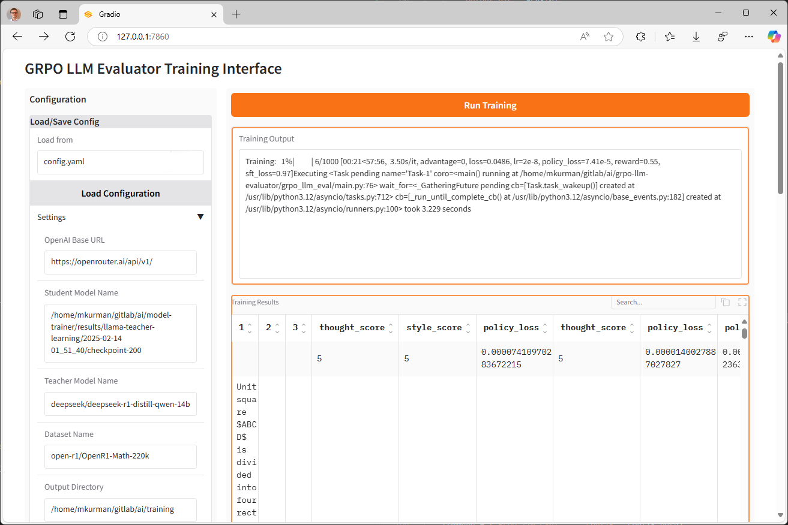

# GRPO LLM Evaluator

This project implements a Group Relative Policy Optimization (GRPO) based LLM evaluator, with an option for supervised fine-tuning (SFT) on evaluation feedback. It leverages the `unsloth` library for efficient model training and inference.


## Overview

The primary goal of this project is to fine-tune a student LLM using feedback from a teacher LLM. The GRPO method is used to optimize the student model's policy based on the rewards derived from the teacher's feedback. Additionally, the project supports SFT to further refine the student model using the teacher's feedback as training data.

## Key Components

-   **`grpo_llm_eval` Directory**: Contains the core logic of the project.
    -   **`func` Directory**: Contains functional modules.
        -   `trl_utils.py`: Implements GRPO loss computation and SFT training loop.
        -   `model_utils.py`: Defines functions for loading student and teacher models.
        -   `generation_utils.py`: Implements response generation using the student model.
        -   `evaluation_utils.py`: Implements evaluation of student responses using a teacher model.
        -   `data_utils.py`: Implements data loading and preprocessing.
        -   `config_utils.py`: Implements configuration loading from YAML files.
    -   `config.py`: Defines the `TrainingConfig` dataclass.
    -   `args.py`: Defines command-line argument parsing.
    -   `configs` Directory: Contains example YAML configuration files.

## Workflow

1.  **Configuration**: The training process is configured using a YAML file (e.g., `configs/example.yaml`). This file specifies the student model, teacher model, dataset, and training hyperparameters.
2.  **Data Loading**: The dataset is loaded using the `load_dataset_function` in `data_utils.py`.
3.  **Response Generation**: The student model generates responses to the input prompts using `generate_response` in `generation_utils.py`.
4.  **Evaluation**: The teacher model evaluates the student's responses using `evaluate_response` in `evaluation_utils.py`, providing feedback in the form of scores and explanations.
5.  **GRPO Training**: The GRPO loss is computed using `compute_loss` in `trl_utils.py`, and the student model is updated to optimize its policy based on the teacher's feedback.
6.  **SFT (Optional)**: The student model is further fine-tuned using the teacher's feedback as training data, with the `sft_on_eval` function in `trl_utils.py`.
7.  **Logging**: Training data, including original inputs, student responses, teacher feedback, rewards, and losses, are saved to a JSONL file in the output directory.

## Usage

1.  **Clone the repository:**

    ```bash
    git clone https://github.com/mkurman/grpo-llm-evaluator
    cd grpo-llm-evaluator
    ```

2.  **Install the dependencies:**

    ```bash
    pip install -e .
    ```

3.  **Configure the training:**
    -   Create a YAML configuration file (e.g., `configs/example.yaml`) with the desired training parameters.
    -   Ensure that the `student_model_name`, `teacher_model_name`, and `dataset_name` parameters are correctly set.
    -   Set the `openai_base_url` variable to the correct URL if you want to use any compatible apis or leave it empty to use the default value.
    -   Set the `OPENAI_API_KEY` environment variable to your OpenAI API key if you want to use OpenAI or any compatible apis. (e.g., `export OPENAI_API_KEY=ollama`)

4.  **Run the training script:**

    ```bash
    grpo_llm_eval --config configs/example.yaml
    ```

5.  **Use the Graphical Interface:**

    ```bash
    grpo_llm_eval_ui
    ```

    The Gradio interface provides:
    - Easy configuration of all training parameters
    - Real-time training progress monitoring
    - Live display of training results
    - Interactive data exploration
    - Configuration loading/saving capabilities

    The interface consists of:
    - A sidebar with all configuration parameters
    - A main panel showing:
        - Training progress and logs
        - Results in a searchable, sortable table
        - Export options for training data

    The interface is accessible at `http://localhost:7860` by default.
    

## Configuration Details

The training process is configured using the `TrainingConfig` dataclass in `config.py` defines the available configuration parameters. Here's a brief overview:

| Attribute             | Description                               | Type    | Default Value                      |
| --------------------- | ----------------------------------------- | ------- | ---------------------------------- |
| `openai_base_url`     | Base URL for the OpenAI API.              | str     | `"http://localhost/v1/"`           |
| `student_model_name`  | Name or path of the student model.        | str     | `"mkurman/Llama-3.2-MedIT-SUN-2.5B-BT-GRPO"` |
| `teacher_model_name`  | Name or path of the teacher model.        | str     | `"mkurman/Qwen2.5-14B-DeepSeek-R1-1M"` |
| `dataset_name`        | Name of the dataset to use.               | str     | `"open-r1/OpenR1-Math-220k"`      |
| `output_dir`          | Directory to save the training outputs.   | str     | `"~/.models/"`                     |
| `save_steps`          | Number of steps between each save.        | int     | `50`                               |
| `learning_rate`       | Learning rate for the optimizer.          | float   | `5e-7`                             |
| `max_new_tokens`      | Maximum number of new tokens to generate. | int     | `4096`                             |
| `max_feedback_new_tokens`| Maximum number of new tokens in feedback. | int     | `4096`                             |
| `num_return_sequences`| Number of sequences to return.            | int     | `2`                                |
| `accumulation_steps`  | Number of accumulation steps.             | int     | `1`                                |
| `temperature`         | Temperature for sampling.                 | float   | `0.7`                              |
| `top_p`               | Top p value for sampling.                 | float   | `0.9`                              |
| `top_k`               | Top k value for sampling.                 | int     | `50`                               |
| `max_seq_length`      | Maximum sequence length.                  | int     | `4096`                             |
| `cache_dir`           | Directory to cache models/datasets.       | str     | `"~/.cache/"`                      |
| `warmup_steps`        | Number of warmup steps.                   | int     | `100`                              |
| `total_steps`         | Total number of training steps.           | int     | `1000`                             |
| `seed`                | Random seed.                              | int     | `3409`                             |
| `max_grad_norm`       | Maximum gradient norm.                      | float   | `0.1`                              |
| `grpo_beta`           | Beta value for GRPO loss.                 | float   | `0.05`                             |
| `sft_beta`            | Beta value for SFT loss.                  | float   | `0.05`                             |
| `thought_process_weight`| Weight for thought process score.       | float   | `0.07`                             |
| `answer_weight`       | Weight for answer score.                  | float   | `0.1`                              |
| `format_weight`         | Weight for format score.                  | float   | `0.03`                             |
| `use_unsloth`         | Whether to use unsloth for optimizations. | bool    | `True`                             |
| `load_in_4bit`        | Whether to load model in 4-bit quantization. | bool  | `True`                             |
| `system_prompt`       | System prompt to use for generation.      | Optional[str] | `"Respond in the following format:\n<think>\n...\n</think>\n...\n$\\boxed{answer}$"` |
| `evaluation_prompt`   | Evaluation prompt to use for the teacher model. | Optional[str] | `"You are a teacher evaluating a student's answer. Evaluate the following student's response in two parts:\n1) Correctness of the thought process (rated from 1 to 10), and\n2) Correctness of the final answer (rated from 1 to 10).\n3) Format and clarity of the response (rated from 1 to 10). Student must have <think> and </think> tags included! If not, give 0 points for this assesment.\n\nThink about the student's thought process and the final answer using <think> ... </think> tags.\nProvide detailed feedback after your thinking process using the following XML format:\n<evaluation>\n  <thought_process><score>{score}</score><explanation>{explanation}</thought_process>\n  <answer><score>{score}</score><explanation>{explanation}</answer>\n  <format><score>{score}</score><explanation>{explanation}</format>\n</evaluation>\n\nStudent Response:\n{student_response}\nGround Truth:\n{ground_truth}\n"` |
| `think_open_string`   | String to indicate the start of the thought process. | str | `"<think>"` |
| `think_close_string`  | String to indicate the end of the thought process. | str | `"</think>"` |

## Contributing

Contributions to this project are welcome. Please submit a pull request with a clear description of the changes.

## License
Apache License 2.0

## Citation
If you use this code in your research, please consider citing the following paper:

```
@misc{grpollmeval2025,
  title={GRPO LLM Evaluator with SFT},
  author={Mariusz Kurman},
  year={2025},
  publisher = {GitHub},
  journal = {GitHub repository},
  howpublished = {\url{https://github.com/mkurman/grpo-llm-evaluator}}
}